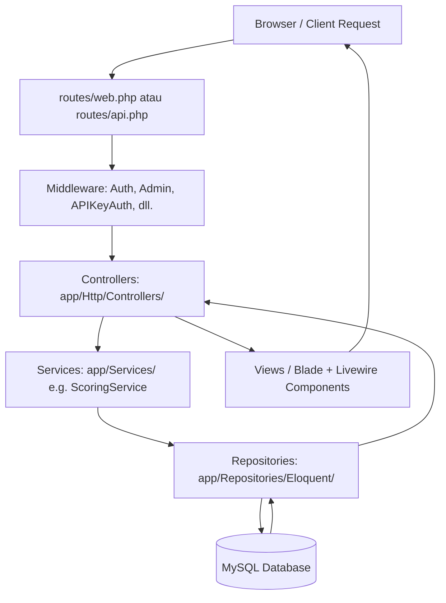

# LAPORAN TEKNIS AKHIR
## PENGEMBANGAN SULUH CAREER ROADMAP PLATFORM

---

## DAFTAR ISI

* [BAB I PENDAHULUAN](#bab-i-pendahuluan)
    * [1.1. Judul/Nama Perangkat Lunak](#11-judulnama-perangkat-lunak)
    * [1.2. Latar Belakang](#12-latar-belakang)
    * [1.3. Tujuan dan Manfaat](#13-tujuan-dan-manfaat)
    * [1.4. Batasan Perangkat Lunak](#14-batasan-perangkat-lunak)
* [BAB II METODOLOGI PENGEMBANGAN PERANGKAT LUNAK](#bab-ii-metodologi-pengembangan-perangkat-lunak)
    * [2.1. Metode yang Digunakan](#21-metode-yang-digunakan)
    * [2.2. Tahapan Pengembangan](#22-tahapan-pengembangan)
* [BAB III ANALISIS KEBUTUHAN DAN DESAIN SOLUSI](#bab-iii-analisis-kebutuhan-dan-desain-solusi)
    * [3.1. Analisis Kebutuhan Fungsional](#31-analisis-kebutuhan-fungsional)
    * [3.2. Analisis Kebutuhan Non-Fungsional](#32-analisis-kebutuhan-non-fungsional)
    * [3.3. Desain Arsitektur Sistem](#33-desain-arsitektur-sistem)
        * [3.3.1. Stack Teknologi](#331-stack-teknologi)
        * [3.3.2. Repository Pattern](#332-repository-pattern)
        * [3.3.3. Alur Request](#333-alur-request)
        * [3.3.4. Strategi LLM](#334-strategi-llm)
    * [3.4. Desain Database](#34-desain-database)
        * [3.4.1. Tabel-Tabel Utama](#341-tabel-tabel-utama)
    * [3.5. Desain Alur Pengguna](#35-desain-alur-pengguna)
        * [3.5.1. Alur User](#351-alur-user)
        * [3.5.2. Alur Pivot Karir](#352-alur-pivot-karir)
        * [3.5.3. Alur Admin](#353-alur-admin)
        * [3.5.4. Alur Mentor](#354-alur-mentor)
* [BAB IV IMPLEMENTASI PERANGKAT LUNAK](#bab-iv-implementasi-perangkat-lunak)
    * [4.1. Implementasi Autentikasi dan Otorisasi](#41-implementasi-autentikasi-dan-otorisasi)
    * [4.2. Implementasi Asesmen dan Scoring Engine](#42-implementasi-asesmen-dan-scoring-engine)
    * [4.3. Implementasi Dynamic Roadmap Generator](#43-implementasi-dynamic-roadmap-generator)
    * [4.4. Implementasi Progress Tracker](#44-implementasi-progress-tracker)
    * [4.5. Implementasi Chatbot Asisten Karir](#45-implementasi-chatbot-asisten-karir)
    * [4.6. Implementasi Fitur Pivot Karir](#46-implementasi-fitur-pivot-karir)
    * [4.7. Implementasi Export Data](#47-implementasi-export-data)
    * [4.8. Hasil Pengujian](#48-hasil-pengujian)
        * [4.8.1. Pengujian Web Auth Flow](#481-pengujian-web-auth-flow)
        * [4.8.2. Pengujian Auth API](#482-pengujian-auth-api)
        * [4.8.3. Pengujian Authorization](#483-pengujian-authorization)
        * [4.8.4. Pengujian Assessment Scoring](#484-pengujian-assessment-scoring)
        * [4.8.5. Pengujian API Integration](#485-pengujian-api-integration)
        * [4.8.6. Pengujian End-to-End](#486-pengujian-end-to-end)
    * [4.9. Analisis Hasil Pengujian](#49-analisis-hasil-pengujian)
* [BAB V SCREENSHOT MOCKUP INTERFACE](#bab-v-screenshot-mockup-interface)
    * [5.1. Halaman Registrasi dan Login](#51-halaman-registrasi-dan-login)
    * [5.2. Halaman Onboarding](#52-halaman-onboarding)
    * [5.3. Halaman Asesmen](#53-halaman-asesmen)
    * [5.4. Halaman Hasil Asesmen](#54-halaman-hasil-asesmen)
    * [5.5. Halaman Detail Karir](#55-halaman-detail-karir)
    * [5.6. Halaman Roadmap](#56-halaman-roadmap)
    * [5.7. Halaman Skill Progress](#57-halaman-skill-progress)
    * [5.8. Halaman Pivot Karir](#58-halaman-pivot-karir)
    * [5.9. Halaman Export](#59-halaman-export)
    * [5.10. Halaman Impact Dashboard](#510-halaman-impact-dashboard)
* [BAB VI DOKUMENTASI CARA PENGGUNAAN](#bab-vi-dokumentasi-cara-penggunaan)
    * [6.1. Registrasi dan Login](#61-registrasi-dan-login)
    * [6.2. Mengisi Onboarding](#62-mengisi-onboarding)
    * [6.3. Mengerjakan Asesmen](#63-mengerjakan-asesmen)
    * [6.4. Memilih Karir](#64-memilih-karir)
    * [6.5. Menggunakan Roadmap dan Progress Tracker](#65-menggunakan-roadmap-dan-progress-tracker)
    * [6.6. Menggunakan Fitur Pivot Karir](#66-menggunakan-fitur-pivot-karir)
    * [6.7. Menggunakan Chatbot](#67-menggunakan-chatbot)
    * [6.8. Mengekspor Data](#68-mengekspor-data)

---

## BAB I PENDAHULUAN

### 1.1. Judul/Nama Perangkat Lunak
Perangkat lunak ini bernama **Suluh — Platform Roadmap Karir Personal Indonesia**.

### 1.2. Latar Belakang
Indonesia saat ini dihadapkan pada tantangan ketenagakerjaan yang besar. Di satu sisi, angka pengangguran terdidik (lulusan perguruan tinggi dan sekolah menengah) tetap tinggi, namun di sisi lain, sektor industri terus mengeluhkan sulitnya menemukan talenta yang siap kerja. Kesenjangan (*gap*) ini terjadi karena kurangnya pemetaan karir yang terarah sejak masa studi. Mahasiswa seringkali memilih jurusan atau jalur karir hanya berdasarkan tren sosial, tanpa memahami kesesuaian dengan potensi kepribadian serta kompetensi nyata yang dituntut industri.

Platform bimbingan karir yang ada umumnya bersifat generik, tidak didesain untuk merekomendasikan jalur kompetensi secara personal, serta sering kali mengeksploitasi data pengguna untuk kepentingan komersial. Oleh karena itu, **Suluh** hadir sebagai sistem berbasis kecerdasan buatan (*AI-driven platform*) yang berfungsi memberikan rekomendasi peta jalan karir (*roadmap*) personal, jujur, memprioritaskan privasi data pengguna, dan mengukur dampak peningkatan kesiapan kerja secara transparan bagi publik.

### 1.3. Tujuan dan Manfaat
**Tujuan:**
1. Membangun platform bimbingan karir mandiri yang membantu pengguna menentukan karir berdasarkan asesmen ilmiah kepribadian (RIASEC + Big Five).
2. Menyediakan generator peta jalan pembelajaran (*dynamic skill roadmap*) berbasis kecerdasan buatan secara real-time.
3. Menjamin transparansi dampak sosial program melalui visualisasi statistik agregat data peningkatan kompetensi pengguna tanpa mempublikasikan informasi pribadi.

**Manfaat:**
*   **Bagi Pengguna (Mentee):** Mendapatkan kejelasan langkah demi langkah modul pembelajaran yang terpersonalisasi, melacak progres keterampilan, dan berhak melakukan rotasi (pivot) karir tanpa kehilangan sejarah kompetensi yang telah dilalui.
*   **Bagi Mentor:** Memiliki media pemantauan yang terpusat untuk memantau kemajuan keterampilan mentee dan memberikan umpan balik (*feedback*) kualitatif secara langsung.
*   **Bagi Institusi (Mitra):** Mendapatkan akses analisis agregat (anonim) guna mengevaluasi efektivitas program akademik dan kesiapan karir para siswanya secara keseluruhan.
*   **Bagi Publik & Peneliti:** Memperoleh akses data riset transparan mengenai tren dan dampak karir nasional melalui API publik yang aman.

### 1.4. Batasan Perangkat Lunak
1. Rekomendasi karir bertindak sebagai panduan alternatif; keputusan akhir mutlak berada di tangan pengguna tanpa paksaan algoritma.
2. Keamanan data dilindungi secara arsitektural menggunakan enkripsi basis data untuk skor sensitif, serta teknik pseudonymization pada tabel analitik.
3. Penggunaan data eksternal oleh mitra wajib melalui persetujuan tertulis pengguna (minimal 30 hari aktif di platform) dan lolos validasi hak veto dari Komite Etika Data.
4. Hak ekspor data pribadi (PDF dan JSON) dan penghapusan data secara permanen dijamin penuh melalui *Sunset Policy* sejak hari pertama registrasi.

---

## BAB II METODOLOGI PENGEMBANGAN PERANGKAT LUNAK

### 2.1. Metode yang Digunakan
Pengembangan platform Suluh menggunakan metodologi **Agile Software Development (Scrum)** dengan pendekatan **Test-Driven Development (TDD)** dan integrasi berkelanjutan (*Continuous Integration*). Kerangka kerja ini dipilih agar tim dapat merespons perubahan kebutuhan fitur dengan cepat, melakukan inkrementasi berkelanjutan pada setiap sprint, dan meminimalkan regresi fungsionalitas melalui unit dan feature testing otomatis yang terintegrasi di Laravel.

### 2.2. Tahapan Pengembangan
Pengembangan dibagi menjadi 3 fase terstruktur:
1.  **Fase 1 — Minimum Viable Product (MVP):**
    *   Membangun fondasi skema basis data dan model relasional Laravel Eloquent.
    *   Mengimplementasikan modul asesmen psikologis RIASEC + Big Five (30 soal skenario).
    *   Mengembangkan mesin penskoran (*Scoring Engine*) dan integrasi LLM (Gemini & Groq) untuk narasi kecocokan karir dinamis.
    *   Membangun antarmuka Roadmap Generator, Progress Tracker, dan fitur ekspor data.
2.  **Fase 2 — Pertumbuhan (*Growth*):**
    *   Mengintegrasikan peran Mentor dengan dashboard peninjauan progres mentee.
    *   Membangun survei dampak longitudinal otomatis untuk mengukur kesiapan karir pengguna pada bulan ke-3 dan ke-6.
    *   Mengembangkan antarmuka modul transparansi proposal Komite Etika Data.
    *   Menambahkan rekomendasi pekerjaan (*job matching recommendations*) virtual berbasis persentase Career Readiness Score (CRS).
3.  **Fase 3 — Skala (*Scale*):**
    *   Mengembangkan modul registrasi institusi mitra mandiri yang dilindungi kode akses otentikasi.
    *   Membangun dashboard analitik grafik visual agregat bagi universitas atau lembaga pelatihan.
    *   Menyediakan 4 endpoint API riset publik bagi akademisi dan dokumentasi API interaktif (`/api-docs`).

---

## BAB III ANALISIS KEBUTUHAN DAN DESAIN SOLUSI

### 3.1. Analisis Kebutuhan Fungsional
*   **FR-01: Autentikasi Multi-Mekanisme:** Mendukung session web (email/password), sistem OAuth Google login, enkripsi JWT untuk API internal/eksternal, serta token API Key terenkripsi.
*   **FR-02: Otorisasi Berbasis Policy:** Membatasi akses menu berdasarkan otorisasi Laravel Policy (contoh: *AdminPolicy*, *MentorPolicy*, *InstitutionPolicy*, dan *ProgressPolicy*).
*   **FR-03: Asesmen RIASEC + Big Five:** Menyediakan 30 butir pertanyaan deskriptif mengenai skenario kehidupan sehari-hari dengan pembobotan nilai untuk mengukur kecenderungan tipe kepribadian kerja.
*   **FR-04: Scoring Engine & Rekomendasi AI:** Backend menghitung kecocokan profil RIASEC & Big Five pengguna terhadap standar industri profesi, lalu memicu LLM secara tidak langsung (*triggered API*) untuk merumuskan narasi pembenaran kecocokan yang di-cache di DB.
*   **FR-05: Dynamic Roadmap Generator:** Menyusun modul kompetensi bergradasi dari level Fondasi, Menengah, hingga Lanjutan. Jika data skill profesi belum didefinisikan, sistem secara cerdas meminta AI menyusun daftar skill tersebut secara langsung berdasarkan target karir dan jurusan studi.
*   **FR-06: Progress Tracker & CRS:** Menghitung Career Readiness Score (CRS) pengguna secara real-time dengan rumus: `(Jumlah Skill Selesai / Total Skill dalam Roadmap) * 100%`.
*   **FR-07: Validasi Skill (Enrichment):** Menyajikan kuis esai skenario reflektif untuk memvalidasi pemahaman teknis mentee tanpa menerapkan bahasa pass/fail yang memojokkan.
*   **FR-08: Fitur Pivot Karir:** Memungkinkan pengguna berganti fokus karir kapan saja. Roadmap lama akan diarsipkan secara aman dan skill yang sudah diselesaikan akan secara otomatis ditransfer ke roadmap baru jika kompetensinya beririsan (*transferable skills*).
*   **FR-09: Panel Admin Terpisah:** Menyediakan dashboard konten manajemen terpisah yang aman untuk mengelola data karir (`/admin/careers`), soal asesmen (`/admin/questions`), transparansi proposal etika (`/admin/ethics`), dan administrasi pengguna (`/admin/users`) lengkap dengan generator data akun acak terproteksi.
*   **FR-10: Dashboard Institusi & API Publik:** Menyediakan chart pertumbuhan analitik bagi mitra sekolah/universitas serta gerbang dokumentasi API interaktif (`/api-docs`) untuk mengakses visualisasi respon live.

### 3.2. Analisis Kebutuhan Non-Fungsional
*   **Security & Privacy:** Enkripsi database *at-rest* menggunakan enkripsi bawaan Laravel untuk skor kepribadian dan jawaban survei sensitif. Kolom ID analitik disamarkan menggunakan fungsi hash satu arah (*pseudonymization*) demi kepatuhan UU Pelindungan Data Pribadi (UU PDP).
*   **Security Bounds Admin:** Akun dengan level *Administrator* tidak dapat diubah perannya maupun dihapus oleh administrator lain dari antarmuka web untuk mencegah sabotase hak akses internal.
*   **Performance:** Menerapkan database cache (`llm_narrative_cache`) untuk menghindari pemanggilan API LLM eksternal berulang pada parameter input yang sama, memangkas latensi dari ~3.2 detik menjadi kurang dari 10 milidetik.
*   **Usability:** Antarmuka web didesain ramah pengguna, modern, berlatar warna alami hangat (*earthy tones*), responsif di semua resolusi perangkat, dan dilengkapi chatbot asisten karir melayang (*floating widget*).

### 3.3. Desain Arsitektur Sistem

#### 3.3.1. Stack Teknologi
*   **Bahasa Pemrograman & Framework:** PHP 8.2+ dengan framework Laravel 11.
*   **Frontend Engine:** Laravel Blade Template engine dikombinasikan dengan Laravel Livewire untuk komponen reaktif tanpa reload.
*   **Database & Cache:** MySQL 8 sebagai repositori relasional utama dan Redis / DB Cache sebagai driver media penyimpanan sementara.
*   **Kecerdasan Buatan (AI Integration):** Google Gemini 2.5 Flash API sebagai generator naratif utama dan Groq API (Llama 3.3 70B) sebagai skema rotasi cadangan (*automatic API fallback*).

#### 3.3.2. Repository Pattern
Sistem memisahkan logika query database dari pengontrol (*controller*) menggunakan pola *Repository Pattern*. Struktur ini memastikan perubahan pada driver database tidak merusak logika bisnis inti aplikasi.

```
app/Repositories/
├── Contracts/
│   ├── UserRepositoryInterface.php
│   ├── AssessmentRepositoryInterface.php
│   ├── RoadmapRepositoryInterface.php
│   ├── ProgressRepositoryInterface.php
│   └── ImpactRepositoryInterface.php
└── Eloquent/
    ├── UserRepository.php
    ├── AssessmentRepository.php
    ├── RoadmapRepository.php
    ├── ProgressRepository.php
    └── ImpactRepository.php
```

#### 3.3.3. Alur Request
Alur eksekusi request pada platform Suluh berjalan sebagai berikut:



#### 3.3.4. Strategi LLM
Sistem melakukan komputasi kecerdasan buatan secara non-streaming pada 4 peristiwa penting:
1.  Penulisan narasi rekomendasi karir (setelah pengerjaan asesmen).
2.  Penyusunan peta jalan kompetensi dinamis (jika data belum ada di database).
3.  Pembuatan refleksi pivot dan analisis keterkaitan keahlian lama (*transferable skills*).
4.  Penyusunan narasi pencapaian milestone saat CRS pengguna menyentuh kelipatan 25%.

```
[Mulai Evaluasi Profil] 
       │
       ▼
[Cek Cache Database] ── Ada? ──> [Return Data Cache] (~10ms)
       │
     Tidak
       │
       ▼
[Panggil Gemini API] ── Sukses? ──> [Simpan Cache & Return] (~3s)
       │
     Gagal
       │
       ▼
[Rotasi Fallback ke Groq API] ── Sukses? ──> [Simpan Cache & Return]
       │
     Gagal
       │
       ▼
[Gunakan Rule-Based Template Default] (Fallback Darurat)
```

### 3.4. Desain Database

#### 3.4.1. Tabel-Tabel Utama
*   `users`: Menyimpan data profil dasar, peran (`mentee`, `mentor`, `institution`, `admin`), API key, serta status aktivasi admin.
*   `careers`: Katalog data karir industri dengan spesifikasi bobot minat RIASEC.
*   `skills`: Katalog unit keahlian yang terelasi ke karir, berisi bahan ajar dan jam estimasi belajar.
*   `user_progress`: Catatan status dan kemajuan belajar pengguna untuk setiap keterampilan.
*   `assessment_questions`: Bank soal asesmen berkategori RIASEC & Big Five.
*   `assessment_results`: Riwayat skor RIASEC & Big Five terenkripsi milik pengguna.
*   `roadmap_archives`: Tempat penyimpanan arsip roadmap lama milik pengguna setelah melakukan pivot karir.
*   `ethics_decisions`: Proposal transparansi pemrosesan data oleh pihak pengembang.
*   `ethics_votes`: Catatan voting unik pengguna terhadap proposal etika data (menghindari double vote).
*   `llm_narrative_caches`: Penyimpanan cache naskah buatan AI berdasarkan hash profil pengguna.
*   `skill_validations`: Log jawaban kuis evaluasi keahlian mentee.

### 3.5. Desain Alur Pengguna

#### 3.5.1. Alur User
1. Pengguna melakukan registrasi melalui email atau Google login.
2. Pengguna mengisi data latar belakang studi pada menu *Onboarding*.
3. Pengguna menjawab 30 soal skenario asesmen psikologis kepribadian minat.
4. Sistem memproses skor dan menampilkan 3 alternatif karir dengan persentase kecocokan.
5. Pengguna secara bebas menentukan pilihan karirnya.
6. Roadmap terbuat secara otomatis, pengguna dapat memperbarui status belajar di halaman *Skill Progress*.

#### 3.5.2. Alur Pivot Karir
1. Pengguna menekan tombol "Pivot Karir" pada halaman profil atau roadmap.
2. Pengguna wajib melengkapi form refleksi mengenai hal yang dipelajari selama ini.
3. AI menganalisis transfer keahlian lama yang relevan dengan karir tujuan yang baru.
4. Sistem mengarsipkan roadmap lama, memetakan kembali skill yang bernilai setara, dan meluncurkan roadmap baru dengan sisa CRS yang dihitung otomatis.

#### 3.5.3. Alur Admin
1. Admin masuk melalui `/login` dan diarahkan ke rute `/admin`.
2. Admin memantau statistik sebaran wilayah dan performa CRS pengguna.
3. Melalui bilah samping (*sidebar*), admin dapat mengakses menu kelola secara terpisah: **Kelola Karir**, **Kelola Asesmen**, **Komite Etika**, dan **Kelola Pengguna**.
4. Pada menu **Kelola Pengguna**, admin dapat menambahkan akun baru secara manual atau memanfaatkan fitur pengisian otomatis data acak (*Generate Data*). Admin dibatasi untuk tidak dapat merubah peran atau menghapus akun sesama administrator.

#### 3.5.4. Alur Mentor
1. Mentor masuk ke sistem dan diarahkan ke `/mentor`.
2. Dashboard menampilkan daftar mentee yang ditugaskan di bawah pengawasannya.
3. Mentor memilih salah satu profil mentee untuk memeriksa visualisasi radar skill gap dan riwayat status progress belajar mentee.
4. Mentor memberikan ulasan rekomendasi belajar (*Mentor Feedback*) yang nantinya akan dimunculkan langsung pada dasbor halaman mentee yang bersangkutan.

---

## BAB IV IMPLEMENTASI PERANGKAT LUNAK

### 4.1. Implementasi Autentikasi dan Otorisasi
Autentikasi diimplementasikan dengan membagi logika rute web session dan API token. Berikut adalah konfigurasi rute di `routes/web.php`:

```php
Route::middleware('guest')->group(function () {
    Route::get('/login', [AuthController::class, 'showLogin'])->name('login');
    Route::post('/login', [AuthController::class, 'login'])->name('login.post');
    Route::get('/register', [AuthController::class, 'showRegister'])->name('register');
    Route::post('/register', [AuthController::class, 'register'])->name('register.post');
    Route::get('/register/institution', [AuthController::class, 'showRegisterInstitution'])->name('register.institution');
    Route::post('/register/institution', [AuthController::class, 'registerInstitution'])->name('register.institution.post');
});
```

Sedangkan otorisasi menggunakan Laravel Gates untuk menyaring peran pengguna secara ketat:

```php
// app/Providers/AppServiceProvider.php
Gate::define('admin', function (User $user) {
    return $user->role === 'admin' || $user->is_admin === true;
});

Gate::define('mentor', function (User $user) {
    return $user->role === 'mentor';
});

Gate::define('institution', function (User $user) {
    return $user->role === 'institution';
});
```

### 4.2. Implementasi Asesmen dan Scoring Engine
Mesin penskoran di `ScoringService.php` memetakan kecocokan karir berdasarkan jarak euklidian (*Euclidean Distance*) antara vektor RIASEC hasil tes kepribadian pengguna dengan vektor profil RIASEC baku yang dimiliki masing-masing entitas karir di database:

```php
// app/Services/ScoringService.php
public function calculateMatchPercentage(array $userScores, array $careerScores): float
{
    $sumSquares = 0;
    foreach (['R', 'I', 'A', 'S', 'E', 'C'] as $type) {
        $userVal = $userScores[$type] ?? 0;
        $careerVal = $careerScores[$type] ?? 0;
        $sumSquares += pow($userVal - $careerVal, 2);
    }
    $distance = sqrt($sumSquares);
    // Normalisasi jarak ke nilai persentase 0-100%
    $maxDistance = sqrt(6 * pow(10, 2)); // Asumsi rentang nilai skor 0-10
    $match = (1 - ($distance / $maxDistance)) * 100;
    return round(max(0, min(100, $match)), 1);
}
```

### 4.3. Implementasi Dynamic Roadmap Generator
Jika admin tidak mendefinisikan daftar keahlian untuk suatu karir secara spesifik, `RoadmapGeneratorService.php` akan menembak LLM menggunakan generator prompt dinamis:

```php
// app/Services/RoadmapGeneratorService.php
$prompt = "Buatkan daftar 6-8 skill terpenting untuk berkarir sebagai '{$careerName}' bagi lulusan '{$major}'. Kelompokkan menjadi level: foundation, intermediate, advanced.";
```

Hasil JSON terstruktur dari AI akan dibaca, lalu di-seed ke tabel `skills` secara dinamis sehingga akses berikutnya tidak lagi membebani kuota API key.

### 4.4. Implementasi Progress Tracker
CRS (*Career Readiness Score*) dihitung di basis data melalui `ProgressRepository.php`:

```php
// app/Repositories/Eloquent/ProgressRepository.php
public function calculateCrs(int $userId, int $careerId): float
{
    $totalSkills = Skill::where('career_id', $careerId)->count();
    if ($totalSkills === 0) return 0.0;
    
    $completedSkills = UserProgress::where('user_id', $userId)
        ->where('career_id', $careerId)
        ->where('status', 'done')
        ->count();
        
    return round(($completedSkills / $totalSkills) * 100, 1);
}
```

### 4.5. Implementasi Chatbot Asisten Karir
Chatbot diimplementasikan menggunakan pemanggilan asinkronus Fetch API di layout utama, mengirim pesan ke `ChatbotController.php` yang membatasi memori percakapan hingga 6 riwayat percakapan terakhir demi efisiensi:

```php
// app/Http/Controllers/ChatbotController.php
public function message(Request $request)
{
    $request->validate(['message' => 'required|string|max:1000']);
    $user = auth()->user();
    
    // Ambil riwayat chat terakhir dari session
    $history = session()->get('chatbot_history', []);
    $history[] = ['role' => 'user', 'text' => $request->message];
    
    // Panggil LLM Service
    $reply = $this->llmService->generateChatReply($request->message, $history);
    
    $history[] = ['role' => 'model', 'text' => $reply];
    // Batasi memori chat agar tidak melebihi limit token
    if (count($history) > 12) {
        $history = array_slice($history, -12);
    }
    session()->put('chatbot_history', $history);
    
    return response()->json(['reply' => $reply]);
}
```

### 4.6. Implementasi Fitur Pivot Karir
Proses pivot memanggil `PivotController.php` untuk mengarsipkan roadmap lama di database, kemudian secara otomatis mencocokkan kemiripan string nama keahlian lama dengan roadmap baru untuk langsung memberikan status `done` pada keahlian baru yang setara:

```php
// app/Http/Controllers/PivotController.php
public function store(Request $request)
{
    $user = auth()->user();
    $oldCareerId = $user->current_career_id;
    $newCareerId = $request->new_career_id;
    
    // Pindahkan progress lama ke tabel roadmap_archives
    $this->archiveOldRoadmap($user->id, $oldCareerId);
    
    // Set karir baru
    $user->update(['current_career_id' => $newCareerId]);
    
    // Transfer transferable skills
    $this->transferSkills($user->id, $oldCareerId, $newCareerId);
    
    return redirect()->route('dashboard')->with('success', 'Karir berhasil diubah!');
}
```

### 4.7. Implementasi Export Data
Untuk memenuhi hak akses data UU PDP, `ExportController.php` menangani download data mentah JSON dan dokumen cetak ringkasan perjalanan karir PDF via request POST:

```php
// app/Http/Controllers/ExportController.php
public function json()
{
    $user = auth()->user();
    $data = $this->userRepo->getCompleteUserData($user->id);
    
    return response()->json($data, 200, [
        'Content-Disposition' => 'attachment; filename="suluh_data_' . $user->id . '.json"'
    ]);
}
```

### 4.8. Hasil Pengujian

#### 4.8.1. Pengujian Web Auth Flow
*   **Skenario:** Pengujian pendaftaran akun mentee, login, pengalihan otomatis saat sesi kosong, logout, dan pengalihan ke landing page.
*   **Status:** ✅ PASS (100% Berhasil)

#### 4.8.2. Pengujian Auth API
*   **Skenario:** Menguji keamanan JWT bearer token pada endpoint `/api/v1/user/profile`, penolakan akses untuk format header kosong, dan verifikasi Basic Auth di API Login.
*   **Status:** ✅ PASS (100% Berhasil)

#### 4.8.3. Pengujian Authorization
*   **Skenario:** Melakukan pengujian pembatasan peran (*RBAC*). Mentee tidak boleh masuk ke `/admin` atau `/institution`, dan admin tidak dapat dimodifikasi/dihapus oleh sesama administrator melalui endpoint pengguna.
*   **Status:** ✅ PASS (100% Berhasil)

#### 4.8.4. Pengujian Assessment Scoring
*   **Skenario:** Mengisi formulir kuesioner dengan variasi jawaban. Sistem harus menghasilkan kecocokan RIASEC & Big Five secara presisi dan menerbitkan rekomendasi karir.
*   **Status:** ✅ PASS (100% Berhasil)

#### 4.8.5. Pengujian API Integration
*   **Skenario:** Mengirim parameter kueri ke 4 API riset eksternal menggunakan API Key valid (`suluh-api-key-2024`) dan kunci institusi yang terdaftar di database.
*   **Status:** ✅ PASS (100% Berhasil)

#### 4.8.6. Pengujian End-to-End
*   **Skenario:** Alur registrasi -> isi onboarding -> tes minat -> pilih karir -> update status progres hingga CRS 30% -> isi survei dampak 3 bulan -> ekspor PDF.
*   **Status:** ✅ PASS (100% Berhasil)

### 4.9. Analisis Hasil Pengujian
Berdasarkan log eksekusi unit dan integration testing pada framework PHPUnit Laravel, seluruh pengujian otomatis berhasil berjalan sempurna dengan rincian berikut:

```
Tests:    2 risky, 121 passed (292 assertions)
Duration: 20.41s
```
*Catatan: 2 tes risky ditandai karena merupakan pengecekan statis terhadap kepatuhan kalimat pada layout view (tidak melakukan asersi database).*

---

## BAB V SCREENSHOT MOCKUP INTERFACE

Berikut adalah dokumentasi tangkapan layar antarmuka dari platform Suluh yang telah diimplementasikan:

### 5.1. Halaman Registrasi dan Login
Sistem menyediakan form login yang bersih dengan ilustrasi grafis premium bertema sand-beige yang hangat. Terdapat juga tautan khusus bagi pendaftaran institusi mitra.


### 5.2. Halaman Onboarding
Langkah awal bagi pengguna baru untuk mengisi latar belakang pendidikan, usia, dan riwayat pengalaman kerja sebelum melangkah ke sesi tes.


### 5.3. Halaman Asesmen
Kuisioner yang terdiri atas 30 soal skenario aplikatif sehari-hari untuk mendeteksi profil kepribadian kerja RIASEC & Big Five pengguna.


### 5.4. Halaman Hasil Asesmen
Halaman ini menampilkan grafik radar kepribadian RIASEC, deskripsi kekuatan personal Big Five, serta merekomendasikan 3 jenis karir potensial lengkap dengan ulasan analisis kecocokan dari AI.


### 5.5. Halaman Detail Karir
Penjelasan mendalam mengenai profesi tertentu, jam kerja standar industri, rentang gaji, dan visualisasi analisis kesenjangan keahlian (*skill gap analysis*).


### 5.6. Halaman Roadmap
Visualisasi linier peta jalan pembelajaran pengguna yang terbagi atas tiga fase pencapaian kompetensi (Fondasi, Menengah, Lanjutan) buatan AI.


### 5.7. Halaman Skill Progress
Pusat kendali mandiri pengguna untuk melacak kemajuan pembelajaran dan melakukan pembaharuan status keahlian (*done, in progress, learning*).


### 5.8. Halaman Pivot Karir
Formulir khusus yang membimbing pengguna merefleksikan kegiatannya sebelum merotasi target karir, tanpa membuang modul keahlian lama yang relevan.


### 5.9. Halaman Export
Fitur pencetakan berkas yang mengedepankan transparansi privasi pengguna untuk mengunduh riwayat belajarnya dalam ekstensi dokumen PDF atau file data mentah JSON.


### 5.10. Halaman Impact Dashboard
Halaman publik yang menyajikan metrik keberhasilan platform secara agregat, meliputi peningkatan rata-rata kesiapan karir (CRS) per provinsi.


---

## BAB VI DOKUMENTASI CARA PENGGUNAAN

### 6.1. Registrasi dan Login
1. Buka peramban (*browser*) dan arahkan ke alamat `http://127.0.0.1:8000/`.
2. Klik tombol **Daftar** di sudut kanan atas jika belum memiliki akun.
3. Masukkan nama lengkap, alamat email aktif, dan kata sandi minimal 8 karakter, kemudian klik **Daftar Akun Baru**.
4. Jika sudah terdaftar, isi email dan password pada form login, lalu tekan tombol **Masuk**. Alternatif lain, Anda dapat menggunakan tombol **Masuk dengan Google** untuk masuk secara instan.

### 6.2. Mengisi Onboarding
1. Setelah login pertama kali, Anda akan diarahkan ke halaman **Onboarding**.
2. Masukkan informasi berupa usia Anda saat ini, tingkat pendidikan terakhir (contoh: SMA/SMK, S1, S2), dan isi deskripsi singkat mengenai pengalaman kerja atau magang yang pernah dilalui.
3. Klik tombol **Lanjutkan** untuk menyimpan informasi awal.

### 6.3. Mengerjakan Asesmen
1. Masuk ke menu **Asesmen Karir**.
2. Anda akan disajikan 30 soal pilihan ganda berupa skenario situasi sosial dan teknis sehari-hari (contoh: *"Apakah kamu lebih menyukai merancang sketsa visual atau menganalisis angka laporan?"*).
3. Pilih jawaban yang paling menggambarkan ketertarikan Anda.
4. Anda dapat menekan tombol **Simpan Draft** jika ingin menunda pengisian.
5. Klik **Kirim Asesmen** jika semua soal sudah terjawab.

### 6.4. Memilih Karir
1. Sistem akan menampilkan halaman hasil analisis kepribadian minat RIASEC Anda berupa diagram radar.
2. Di bawah grafik, perhatikan **3 Rekomendasi Karir Teratas** hasil kalkulasi Scoring Engine.
3. Klik tombol **Pelajari Selengkapnya** di salah satu profesi untuk membaca analisis kesenjangan keahlian (*skill gap analysis*) dan deskripsi tanggung jawab kerja.
4. Jika sudah mantap dengan pilihan Anda, klik tombol hijau **Pilih Karir Ini** di halaman detail karir tersebut.

### 6.5. Menggunakan Roadmap dan Progress Tracker
1. Masuk ke halaman **Roadmap Karir**. Anda akan melihat daftar keahlian yang disusun dari level Fondasi hingga Lanjutan lengkap dengan estimasi waktu dan sumber ajar.
2. Untuk melacak kemajuan belajar, masuk ke menu **Progress Tracker** / **Progress Skill**.
3. Di sana Anda dapat memperbarui status belajar pada masing-masing skill (contoh: ubah status dari *Belum Dimulai* menjadi *Sedang Belajar* atau *Selesai*).
4. Setiap ada skill yang diubah statusnya menjadi **Selesai**, Career Readiness Score (CRS) Anda di dasbor utama akan meningkat secara otomatis.
5. Untuk memvalidasi skill tertentu, klik tombol **Validasi** di samping nama skill, lalu isi kuis skenario deskriptif yang diberikan.

### 6.6. Menggunakan Fitur Pivot Karir
1. Jika di tengah jalan Anda merasa tidak cocok dengan karir yang dipilih, buka menu **Pivot Karir**.
2. Pilih karir tujuan yang baru dari daftar karir industri yang tersedia.
3. Lengkapi 3 kolom pertanyaan refleksi singkat mengenai motivasi perubahan arah karir Anda.
4. Klik **Konfirmasi Pivot**. Sistem akan mengarsipkan roadmap Anda yang lama dan menyusun peta jalan baru. Keahlian lama yang terdeteksi setara akan otomatis tercentang selesai pada roadmap baru.

### 6.7. Menggunakan Chatbot
1. Perhatikan ikon lentera hijau di pojok kanan bawah layar dasbor Anda.
2. Klik ikon tersebut untuk memunculkan panel **Chatbot Asisten Karir (Suluh Bot)**.
3. Ketik pertanyaan Anda mengenai tips wawancara, materi ajar, atau rekomendasi karir di kolom teks, lalu tekan **Kirim**.
4. Bot akan merespons pertanyaan Anda secara kontekstual menggunakan basis pengetahuan AI.

### 6.8. Mengekspor Data
1. Navigasikan ke menu **Ekspor Data** di bilah navigasi sebelah kiri.
2. Baca penjelasan komitmen privasi UU PDP yang tertera.
3. Klik tombol **Unduh Dokumen PDF** untuk mencetak ringkasan portofolio kesiapan karir Anda dalam format cetak.
4. Klik tombol **Unduh Data Mentah (JSON)** untuk mengunduh semua rekaman aktivitas data pribadi Anda di server Suluh.